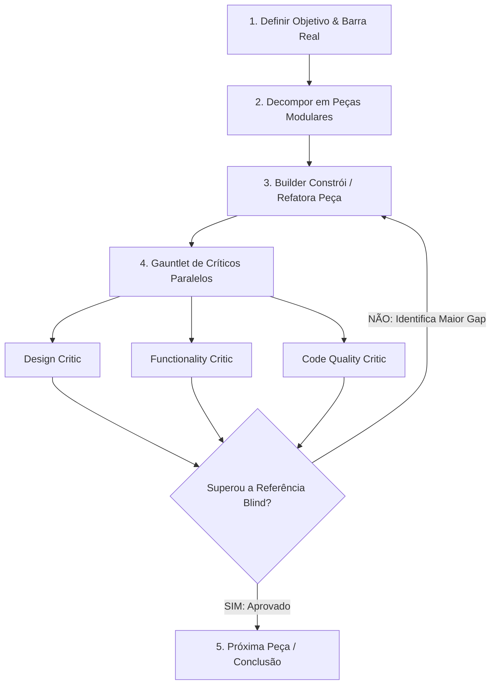

# Gauntlet Loop for Antigravity

O **Gauntlet Loop** (criado por Matt Shumer e empacotado pela comunidade RoboNuggets) é uma metodologia de engenharia de prompts e orquestração multi-agente onde o trabalho não para em "bom o suficiente" ("good enough"), mas itera de forma autônoma até superar uma **barra de qualidade real e verificável**.

---

## Estrutura do Loop



---

## 1. O Conceito Central: A Barra Real (The Quality Bar)

A barra de qualidade é a peça mais importante. Se a barra for vaga ou fictícia, o crítico alucina a aprovação.

Uma barra válida deve ser:
1. **Nomeada (Named):** Algo específico e existente (ex: *"A landing page da Linear"*, *"O checkout da Stripe"*, *"O repo do Zustand"*).
2. **Obtível / Inspecionável (Fetchable):** O crítico consegue abrir a URL, tirar screenshot, ler o código-fonte, rodar os benchmarks ou ler o artigo original.
3. **Comparável (Comparable):** Ambas as saídas podem ser colocadas lado a lado em teste cego (blind test) e o crítico decide qual é superior.

### Exemplos de Barras por Categoria:

| Categoria | Barra Real Recomendada |
|---|---|
| **UI / Web / Landing Pages** | Screenshots ou inspeção ao vivo de produtos referência (Stripe, Linear, Apple, Vercel, Nike). |
| **Jogos / Gráficos 3D / Canvas** | Gravação/screenshots de títulos lançados e consolidados do mesmo gênero. |
| **APIs / Código / Arquitetura** | Repositório open-source consagrado + suite de benchmarks / testes automatizados. |
| **Artigos / Documentação** | Artigo publicado em publicação de referência (ex: Stripe Engineering Blog, Martin Fowler). |

---

## 2. Agentes do Gauntlet Loop no Antigravity

| Agente | Tipo / Papel | Responsabilidade Principal |
|---|---|---|
| **`builder`** | Construtor / Implementador | Constrói a UI, lógica ou código da menor peça possível. Corrige cirurgicamente os gaps indicados pelos críticos. |
| **`design-critic`** | Crítico de Design & UI/UX | Faz avaliação estética, tipográfica, espaçamento, motion, contraste e hierarquia visual contra a barra. |
| **`functionality-critic`** | Crítico de Funcionalidade | Caça ativamente bugs, edge cases, problemas de estado, quebras de fluxo e validação técnica. |
| **`code-quality-critic`** | Crítico de Código & Arquitetura | Avalia tipagem estrita, modularidade, segurança, ausência de dívida técnica e legibilidade. |

---

## 3. Protocolo de Crítica (Blind Test & Single Gap)

O crítico não dá notas subjetivas (ex: "8/10") porque notas inflacionam a cada iteração. O crítico responde a **duas perguntas diretas**:

1. **Veredito Binário:** O trabalho atual vence a barra de referência no teste cego? (**SIM / NÃO**)
2. **O Maior Gap Atual:** Qual é o **ÚNICO** defeito ou gap mais gritante que impede a vitória?

O Builder consome esse gap, faz o ajuste cirúrgico e submete novamente até obter a aprovação de todos os críticos envolvidos.

---

## 4. Como Executar no Antigravity

### Invocando os Subagentes:
```python
# O orquestrador dispara o builder e os críticos usando invoke_subagent:
invoke_subagent(
  Subagents=[
    {
      "TypeName": "builder",
      "Role": "Hero Section Builder",
      "Prompt": "Construa a Hero Section focando no layout e tipografia definidos."
    }
  ]
)
```

Após o builder finalizar, os críticos avaliam:
```python
invoke_subagent(
  Subagents=[
    {
      "TypeName": "design-critic",
      "Role": "Hero Design Critic",
      "Prompt": "Avalie a Hero Section construída comparando com a Hero da Stripe. Diga se venceu e qual o maior gap visual."
    },
    {
      "TypeName": "functionality-critic",
      "Role": "Hero Functionality Critic",
      "Prompt": "Avalie a interatividade dos botões, responsividade mobile e fluxos da Hero Section."
    }
  ]
)
```

---

## 5. Template de Prompt Gauntlet (Para Sessões Autônomas)

```markdown
Construa [OBJETIVO].

A barra de qualidade é [BARRA_REAL]. Obtenha o item de referência real primeiro e compare diretamente contra ele.

Divida o trabalho nas menores peças que possam ser desenvolvidas e julgadas isoladamente. Para cada peça, use o subagente builder e críticos independentes (design-critic, functionality-critic, code-quality-critic).

Cada crítico deve inspecionar o resultado real, comparar lado a lado sem viés contra a referência, declarar se o nosso venceu e nomear o maior gap restante para o builder corrigir.

O crítico deve ser severo e exigente. Não pare até que o trabalho supere a barra de referência.
```
